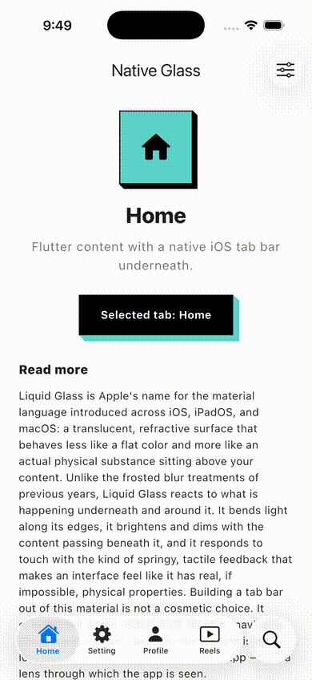

# liquid_glass_bottom_nav_native



Native iOS 26 Liquid Glass bottom tab bar for Flutter.

Embeds a real `UITabBarController` in a platform view, so the bar is
rendered entirely by iOS: the floating glass pill, the sliding selection
platter, and the separated circular search button that morphs into the
system search field — identical to Apple's own apps.

## Requirements

- iOS 26.0+ (set `IPHONEOS_DEPLOYMENT_TARGET = 26.0` in your Runner project)
- iOS only; on other platforms the widget renders the optional `fallback`.

## Usage

Place the widget at the bottom of a fullscreen `Stack` (with
`extendBody: true` on your `Scaffold`):

```dart
LiquidGlassBottomNav(
  items: const [
    LiquidGlassNavItem(title: 'Home', sfSymbol: 'house.fill'),
    LiquidGlassNavItem(title: 'Explore', sfSymbol: 'safari'),
    LiquidGlassNavItem(title: 'Profile', sfSymbol: 'person.fill'),
  ],
  selectedIndex: _selectedIndex,
  onTabSelected: (index) => setState(() => _selectedIndex = index),
  onSearchChanged: (query) => runSearch(query),
)
```

Icons are SF Symbols names, rendered natively.

### Search tab

`showSearchTab` (default true) adds the system search tab. Tapping it
morphs the circular button into the native search field. While search is
open, the widget grows to cover the full screen so the field and keyboard
can render — the native layer is transparent, so Flutter content behind it
stays visible. Wire `onSearchChanged` to filter your content live.
